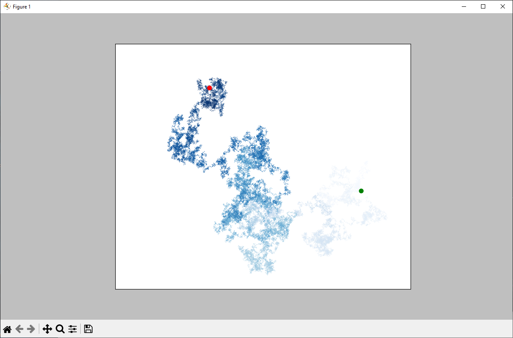

Nazwa projektu: 
Błądzenie losowe

Opis: 
Jest to zmodyfikowana wersja programu z książki autorstwa Eric Matthes pod tytułem: "Python Crash Course: A Hands-On, Project-Based Introduction to Programming" wydanej w 2023 roku przez wydawnictwo No Starch Press. Program służy do generowania wielu błądzeń losowych, czyli ścieżek pozbawionych wyraźnego kierunku, który jest ustalany na podstawie serii losowych decyzji, a ich wynik jest całkowicie nieprzewidywalny,
co może być wykorzystywane m.in. do modelowania cząsteczek w cieczy lub gazie, w procesach stochastycznych, do modelowania cen akcji i rynków finansowych.

Instalacja: 
W celu uruchomienia programu należy:
1. Zainstalować najnowszą wersję programu Python.
2. Pobrać i zainstalować bibliotekę matplotlib przez uruchomienie wiersza poleceń i wpisanie w nim komendy: pip install matplotlib.
3. Sklonować lub pobrać moje repozytorium do nowego folderu na swoim komputerze.
4. Otworzyć plik: wizualizacja_bladzenie_losowego.py

Użycie: 
W pliku `wizualizacja_bladzenia_losowego.py` w argumencie klasy `RandomWalk` (w 8. linii) podajemy liczbę punktów, które mają zostać wygenerowane w ramach błądzenia losowego. 
W funkcji `plt.style.use` (w 12. linii) jako argument możemy podać jeden z dostępnych stylów wykresów w `matplotlib`. 
Wartość argumentu `figsize` funkcji `plt.subplots` (w 12. linii) może być dowolnymi dwoma liczbami, które określają szerokość i wysokość okna wykresu w calach.
W funkcji `ax.scatter` (w 15. linii) jako wartość argumentu `c` możemy podać nazwę koloru w formacie angielskim (np. `'red'`, `'blue'`, itp.), lub jeśli chcemy użyć mapy kolorów, możemy pozostawić domyślną wartość `point_numbers`. Dodatkowo, w argumencie `cmap=plt.cm.` możemy podać nazwę mapy kolorów (np. `plt.cm.Blues`).
Argument `s` w funkcji `ax.scatter` (w 15. linii) służy do określenia wielkości wszystkich kropek na wykresie.
Wartości argumentów `c` i `s` w funkcji `ax.scatter` w 19. linii dotyczą pierwszego punktu błądzenia losowego, gdzie:
- `c` to kolor pierwszego punktu,
- `s` to jego wielkość.
Podobnie, w funkcji `ax.scatter` w 20. linii, argumenty działają analogicznie, ale dotyczą ostatniego punktu błądzenia.
Po wygenerowaniu wykresu błądzenia losowego, istnieje możliwość zapisania go na dysku. W tym celu należy kliknąć na ikonę dyskietki w lewym dolnym rogu wykresu, a następnie wybrać lokalizację, w której chcemy zapisać plik.

Screenshots:

Licencja:
MIT License
