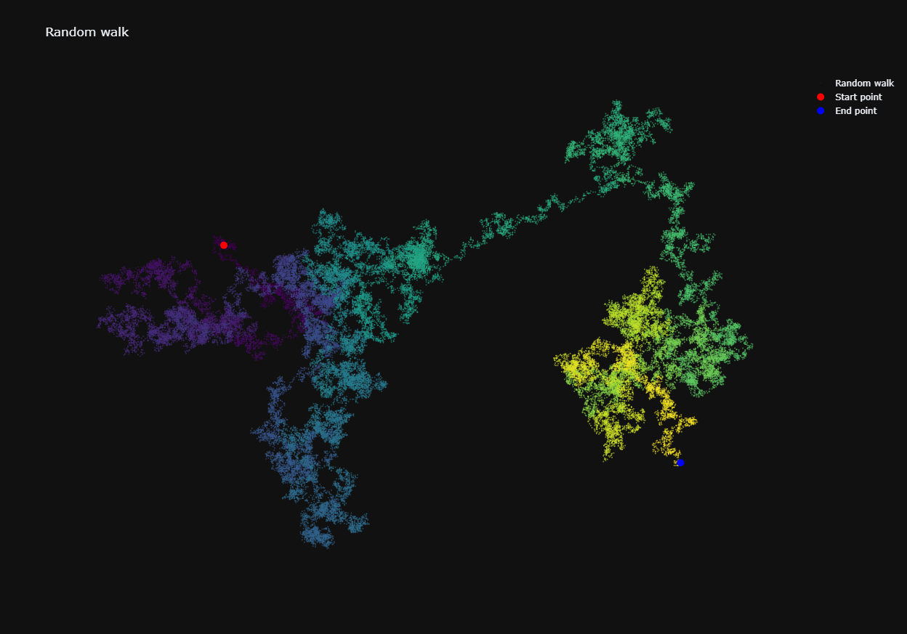

Language:
English

Project name:
Random walk

Description:
The program is used to generate many random walks, i.e. paths without a clear direction, which is determined by a series of random decisions, and their outcome is completely unpredictable,
which can be used, among others, to model particles in a liquid or gas and in stochastic processes.

Installation:
To run the program, you must:
1. Install the latest version of Python.
2. Clone the repository by entering the following command in shell: git clone https://github.com/panzer20/Random_Walk.git
3. Create a virtual environment by entering the following command in the shell: python3 -m venv your_folder_name and then activate it in the shell using the command:
a) In Linux/macOS:
source environment_name/bin/activate
b) In Windows:
source environment_name/Scripts/activate
4. In a shell, go to the folder where the cloned repository is located and type the command: pip install -r requirements.txt
5. Open the file: Random_walk_visualization.py

Usage:
In the file `Random_walk_visualization.py` in the argument of the `RandomWalk` class (line 8) we provide the number of points to be generated as part of the random walk.
The random walk visualization file is saved in the same folder where the Random_walk_visualization.py file is located.

Screenshots:

License: MIT License

Język:
Polski

Nazwa projektu: 
Błądzenie losowe

Opis: 
Program służy do generowania wielu błądzeń losowych, czyli ścieżek pozbawionych wyraźnego kierunku, który jest ustalany na podstawie serii losowych decyzji, a ich wynik jest całkowicie nieprzewidywalny,
co może być wykorzystywane m.in. do modelowania cząsteczek w cieczy lub gazie i w procesach stochastycznych.

Instalacja: 
W celu uruchomienia programu należy:
1. Zainstalować najnowszą wersję programu Python.
2. Sklonować repozytorium przez wpisanie w powłoce polecenia: git clone https://github.com/panzer20/Random_Walk.git
3. Utworzyć środowisko wirtualne przez wprowadzenie w powłoce polecenia: python3 -m venv nazwa_twojego_folderu a następnie aktywować je w powłoce za pomocą polecenia:
a) W Linux/macOS:
source nazwa_środowiska/bin/activate
b) W Windows:
source nazwa_środowiska/Scripts/activate
4. Przejść w powłoce do folderu, w którym znajduje się sklonowane repozytorium i wprowadzić komendę: pip install -r requirements.txt
5. Otworzyć plik: Random_walk_visualization.py

Użycie: 
W pliku `wizualizacja_bladzenia_losowego.py` w argumencie klasy `RandomWalk` (w 8. linii) podajemy liczbę punktów, które mają zostać wygenerowane w ramach błądzenia losowego.
Plik z wizualizacją błądzenia losowego zapisuje się w tym samym folderze, w którym znajduje się plik Random_walk_visualization.py

Screenshots:

Licencja: MIT License
